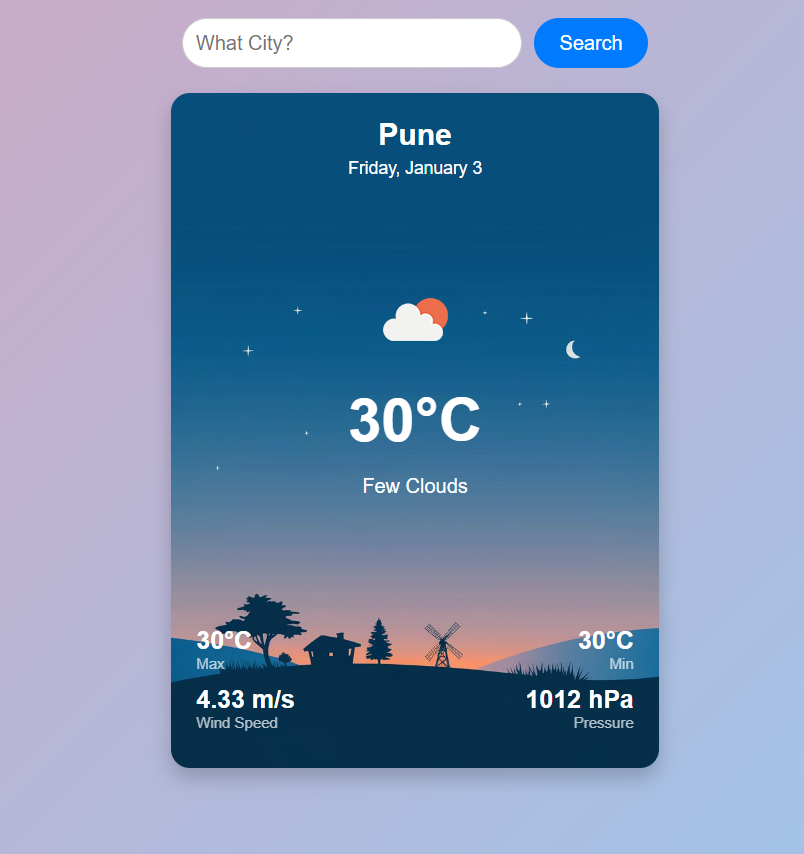

# Weather App 🌤️

A responsive **Weather App** built with **React** and **Vite**, utilizing the **OpenWeatherMap API** to display real-time weather updates. 🌍

[Live Demo](https://weather-app-gamma-orcin-90.vercel.app/)

---


## 📸 Screenshots

| Home Page                        |
|-----------------------------------|
|  |

---

## 🌟 Features

- **Real-time Weather Data** 📊 - Fetches current weather details for any city worldwide.
- **Dynamic Backgrounds** 🎨 - Updates the background gradient based on the time of day.
- **Weather Icons** ☁️ - Displays weather-specific icons from OpenWeatherMap.
- **Responsive Design** 📱 - Fully optimized for desktop and mobile devices.
- **Search Functionality** 🔍 - Allows searching for weather data by city name.
- **Auto Location Detection** 📍 - Detects user location and fetches weather details automatically.
- **Environment Variables** 🔒 - API keys managed securely with `.env`.

---

## 🚀 Tech Stack

- **Frontend**: React, Vite
- **Styling**: CSS, Flexbox
- **API**: OpenWeatherMap
- **HTTP Client**: Axios

---

## 📂 File Structure

```
├── public
│   ├── backgrounds
│   │   ├── morning.jpeg
│   │   ├── afternoon.jpeg
│   │   ├── evening.jpeg
│   │   ├── night.jpeg
├── src
│   ├── components
│   │   ├── WeatherCard.jsx
│   ├── App.jsx
│   ├── main.jsx
│   ├── index.css
├── .env
├── .gitignore
├── package.json
├── vite.config.js
└── README.md
```

---

## 🛠️ Setup Instructions

1. **Clone the Repository** 🛎️
   ```bash
   git clone https://github.com/Abhishek/weather-app.git
   
   cd weather-app
   ```

2. **Install Dependencies** 📦
   ```bash
   npm install
   ```

3. **Set Environment Variables** 🌐
   Create a `.env` file in the root directory and add:
   ```bash
   VITE_API_KEY=your_openweathermap_api_key
   VITE_API_URL=https://api.openweathermap.org/data/2.5/weather
   ```

4. **Start Development Server** 🚀
   ```bash
   npm run dev
   ```

 ```

---


## 📋 TODO

- Add **7-Day Forecast** 📅.
- Implement **Dark Mode** 🌙.
- Enhance **Accessibility** 🦾.
- Add **Error Handling UI** 🚧.

---

## 🤝 Contributing

Contributions are welcome! 🎉
1. Fork the repository.
2. Create a new branch (`feature-branch`).
3. Commit your changes (`git commit -m 'Add new feature'`).
4. Push to the branch (`git push origin feature-branch`).
5. Open a **Pull Request**.

---

## 📧 Contact

- **Author**: Abhishek
- **GitHub**: [Aabi0207](https://github.com/Aabi0207)
- **Email**: abhishekbiradar0207@gmail.com

---

> 🌟 *Star this repository if you found it useful!* ⭐

